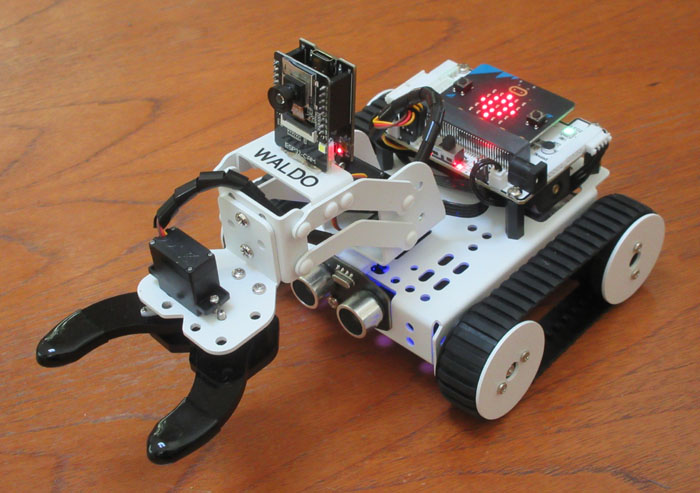

# Baijiu
## A Minimalist Mobile Manipulator

This is about the cheapest (under $200) robot with an arm that you can build. It is based on a small tracked platform with a 2 DOF arm (+ gripper) and has add-on "riders" for audio and video. Remote access to the actuators and sensors is achieved through a combination of Bluetooth LE and wifi, which lets you run your main program offboard on a Windows PC. An example of simple remote keyboard control is provided, as well as a fancier speech-based system using the [ALIA](https://github.com/jconnell11/ALIA) reasoner (see [__video__](https://youtu.be/-0EnkERKow8)). For more examples of robot teaching check out [this](https://arxiv.org/abs/1911.09782) and [this](https://arxiv.org/abs/1911.11620).

### Parts List

To build this robot you will need the Hiwonder [Qtruck](https://www.hiwonder.com/collections/micro-bit-robotics/products/qtruck-programmable-educational-robot?variant=18245492637747) base ($144 incl. Microbit and shipping), Hiwonder [ESP32Cam](https://www.hiwonder.com/products/esp32-cam-ai-vision-module) ($13), a 5V boost [converter](https://www.pololu.com/product/2564) ($6), a 160 degree OV2640 [lens](https://www.amazon.com/dp/B0B5XGMTSZ) ($9), a [USB wifi](https://www.amazon.com/dp/B08F2ZNC6J) adapter ($9), and a 2-way Bluetooth [mini-speaker](https://www.amazon.com/dp/B0BPNYY61M) ($14). You might consider getting a higher capacity [battery](https://www.18650batterystore.com/products/samsung-35e-button-top) as well ($4), although the Qtruck does come with one. A small amount of soldering and gluing is required to complete the robot, as described below.

### Body Assembly

Begin by assembling the Qtruck in the default "transfer" model. Once done, flip the robot over and affix the mini-speaker to the underside using two strips of Gorilla double-sided tape: one on the chassis and one on the battery. The speaker should be mounted with its grill upwards (button downward) and its USB charging port toward the rear of the vehicle. 

Press the button underneath the mini-speaker until the blue light comes on __solid__ then pair the speaker/mic ("BTS0011") with your laptop. Configure "Sound Settings" and choose this device as both the output and input device. You may also need to go into Control Panel, select Speech Recognition, click on "Text to Speech" (on left), hit the "Advanced ..." button, then tell it to "Use this audio output device" making sure the BTS0011 _AG_ version is selected.

### Camera Installation

Start by replacing the camera/lens assembly on the ESP32 board set. Pop the latch on the connector to release the flat cable, then carefully pry under the camera with an X-acto knife to dislodge it from the board. After this, insert the wide-angle module's cable into the connector and re-latch it. If the camera flops around, you can use thin double-sided Scotch tape to secure its backside to the chip.

Now comes the hardest part, modifying the cable to the camera. Although the Qtruck base does provide 5 volts, this is mostly for the arm servos. Any time the robot grabs something, the hand servo will stall out and wreck the 5V supply for about 3 seconds. Therefore, the tiny boost converter board needs to be wired into the power connection. 

Start by cutting the black 4 pin cable that comes with the camera about 3" from one end. Plug the shorter section into Port 3 of the backboard on the Qtruck (front right corner). If you look under this board, you will see that the front two pins are labelled "5V" and "GND". Strip and tin the ends of the corresponding two wires, then solder them into the holes on the U1V10F5 converter board labelled "VIN" and "GND". Similarly, plug the longer cable section into the back board of the camera, which clearly labels the "5V" and "GND" wires. Again, strip and tin the ends of these, then solder them to the "VOUT" and "GND" connections on the converter. Finally, slide a length of heatshrink tubing over the whole board assembly to insulate it (or just wrap it in electrical tape).

To test the setup, power-on the robot and check that the red light on the camera comes on. Next, insert the USB wifi adapter into your laptop and have it connect to SSID "HW_ESP32" (no password needed). At this point you should be able to see live images from the camera by using a browser to view http://192.168.5.1. The image is likely to be upside down, but you can fix this by turning on, then turning off, the "V Flip" switch on the screen. Note that, for better range, you can instead use your main wifi adapter to connect to the camera.

The last task is to mount the camera board on the robot with a big glob of hot melt glue. Prop up the plate under the gripper 50 mm so that the middle section of the arm is roughly flat. Turn the robot on and point your browser to the camera's [URL](http://192.168.5.1). Now spread a thick line of hot melt glue on the back of the middle arm platform, and poke the bottom of the ESP32Cam board into it. The glue should mostly contact the front board and the 4 pin cable should hang off the backside. Tilt the camera slightly so all 4 top screws of the gripper servo are just in view, then hold the boards in this orientation until the glue cools and firms up.

### Software Configuration

Start by copying this whole GitHub directory somewhere on your machine (e.g. "Baijiu"). If you want to muck around with the source code, download Microsoft [Visual Studio](https://visualstudio.microsoft.com/vs/community/) 2022 Community (free). You also need to download and install [Python](https://www.python.org/downloads/windows/) if you do not already have it. Finally, install the additional needed infrastructure by opening a command line and typing:

    py -m pip install kaspersmicrobit keyboard

The Qtruck robot also needs to have software installed that establishes a Bluetooth link with the laptop. To do this, connect the robot to your computer using the mini-USB at the rear of the small Microbit board on top. You should see a drive window pop up with just a few files in it. Drag and drop __qt_blulink.hex__ onto this window to start the programming process. When it is finished, the drive window should re-appear (but there will be no trace of the hex file). 

On the first run, the robot will calibrate its onboard magnetic compass. As suggested by the scrolling message, rotate the robot through all 3 axes until the 25 lights on the back are all on. After this you should see a big red "X" which means the robot is waiting for a connection. You only have to do the calibration once but, if you want to force it to run again, hold down the "B" button while powering-on to enter this mode.

### Sample Applications

At this point you should be able to try out the simple remote-control program. This will pop-up a window with a de-warped version of the camera and allow you to move the robot around using the numberpad, arrow keys, etc. To activate this, turn on the robot and the speaker/mic pod, and make sure that the wifi network "HW_ESP32" is found. Then open a command prompt, "cd" to the installation directory (e.g. "Baijiu"), and enter:

    py pc_blulink.py

To run the more advanced ALIA reasoner it helps (but is not necessary) to set up a Microsoft [__Azure__](https://portal.azure.com/#create/Microsoft.CognitiveServicesSpeechServices) account (essentially free for low usage). From your Azure home page select "Speech Services" then "+ Create" then click on "Manage keys". Modify local text file [spio_win.key](config/spio_win.key) with valid "Key" and "Location" strings to make the example work. To select the voice the robot responds with, open Control Panel, click Speech Recognition, then click on "Text to Speech" (on left) to see your choices.

With or without speech, the ALIA sample will allow you to ask the robot "What is your name?" and command things like "Drive forward". You can also teach it things like "My name is Dan" or "To refuse, move the hand to the left then move it to the right". If rear corner lights are not green, you will need to get its attention by starting your sentence with "robot" or "Waldo". To run this program simply click on the [demo.bat](demo.bat) file, or alternatively enter:

    py pc_blulink.py baijiu_act

### Python Coding

Windows does not allow easy access to Bluetooth LE serial devices. For this reason [KaspersMicrobit](https://kaspersmicrobit.readthedocs.io) is used, which in turn uses the Python [Bleak](https://github.com/hbldh/bleak) library. This means the simplest way to implement the data exchange program is to let Python be the "boss". The Windows PC stub [__pc_blulink__](pc_blulink.py) initiates an exchange by sending down a small decimal-coded command packet. The Microbit processor on the robot then [replies](qt_blulink.py) with its own small hexadecimal-coded sensor packet. The bulk of the processing is handled via callbacks: on_uart_data_received() for the Microbit, and update_issue() for Windows.

If you want to code in Python directly, look at the [__pc_drive__](pc_drive.py) sample. This is a modified version of pc_blulink.py with a main loop that calls the respond() function to examine the keyboard. This updates a collection of global control variables such as "lf" and "grip" that get automatically packaged up and sent down to the robot during the Bluetooth callback update_issue(). The robot's sensors are accessible in the main loop through a set of global variables, like "comp" and "dist".

The sensors are:
* comp - robot heading from 0 to 359 degrees __counter-clockwise__
* tilt - forward/backward attitude from -63 to +64 (front up) degrees (saturates)
* roll - left/right attitude from -63 to +64 (right side up) degrees (saturates)
* dist - obstacle distance from front returned by sonar in inches (200" means none)
* volt - main battery voltage from 3.25 to 4.00 volts (saturates)
* line - 4 line/floor detector bits (1 = reflection) with MSB being far left 

The actuators are:
* lf - left track speed from -100 to +100 (forward), but -50 < lf < 50 --> stop
* rt - right track speed from -100 to +100 (forward), but -50 < rt < 50 --> stop
* base - arm swivel servo in degrees from 0 (far right) to 180 (far left)
* lift - arm shoulder servo in degrees from 30 to 120 (full up), 20 = on floor
* grip - hand finger servo in degrees from 80 to 145 (full open), 85 = closed
* col - breathing color: 0 to 9 = none, red, orn, yel, grn, blu, vio, lav, mag, white
* mth - red diamond symbol on back: 0 = off, 1 = dim, 2 = bright

### C++ Coding

To program in C++ the equivalent is the class [__jhcQtruck__](shared/jhcQtruck.h) but the servo __angles are different__. "Base" is the deviation from straight ahead (-90 to 90), "lift" is the deviation from horizontal (-30 to 40), and "grip" is the deviation from fingers straight out (-15 to 55). 

This class interfaces through a DLL to pc_blulink.py to execute a small amount of additional code during Bluetooth callbacks. In particular, inside the update_issue() function in pc_blulink.py the DLL function ext_swap() calls jhcQtruck::BluSwap(). To maximize the Bluetooth exchange rate, the jhcQtruck class just stores the sensor string and returns a cached command string. Actual work gets performed in a background thread using the overridable member function __Respond()__. Within this function the derived class should call Update() to unpack all the low-level robot sensor info into member variables (like "volt"). And, after the main work is done, it should call Issue() to assemble the low-level actuator member variables (like "lift") into a suitable robot command packet.

The base jhcQtruck class just uses Respond() to print the sensor variables, but you can derive your own class to do fancier things. For instance, the [__jhcQtDrive__](baijiu_test/jhcQtDrive.cpp) class in [baijiu_test](baijiu_test) uses this override to display the camera image and to scan which keys are pressed in order to modify the actuator variables (see get_track()). This example uses the Visual Studio IDE (click on baijiu_test/baijiu_test.sln) to produce a DLL which can be fed as an argument to the Python Bluetooth code. You can then run the example by typing "py pc_blulink.py baijiu_test" (or simply "py pc_blulink.py" since pc_blulink defaults to this DLL). If you re-compile the DLL, make sure to copy it to the top-level directory ("Baijiu") to get the new version.

### Video, Speech, and Reasoning

Images from the robot's camera can be obtained using the [__vid_ocv__](shared/vid_ocv.h) DLL. This code hides much of the mess of OpenCV in Windows and is used to flip the ESP32 image vertically and remove the fisheye lens distortion. The pixel buffer returned by function ocv_get() is bottom-up, left-to-right, BGR order with a focal length of 204.4 pixels (115 degrees horizontal). In addition to capturing an image buffer, the DLL also has the function ocv_queue() to display an image buffer on a named window. This is what is used in the baijiu_test example. 

Speech interactions are mediated via the added mini-speaker/mic pod and the [__spio_win__](shared/spio_win.h) DLL. This hides some of the complexity of the online Azure speech recognition system and local Text-to-Speech generation. The primary calls are reco_status(), reco_heard(), and tts_say(). 
While speech output is native to Windows, you need to configure Azure credentials for speech input (as noted in the [Sample Applications](#sample-applications) section).

For integration with the [ALIA](https://github.com/jconnell11/ALIA) cognitive architecture, see the [baijiu_act](baijiu_act) example. The actual interface to the reasoner is primarily mediated by a bunch of shared variables in the [__alia_act__](baijiu_act/alia_act.h) DLL. For instance, the current heading of the robot is communicated through the variable "alia_bh", and the speed of the robot is commanded through "alia_bmv" (relative to a canonical speed). Note that there are many variables in alia_act that are not used by Qtruck since the DLL was designed to be used with a variety of different (and more sophisticated) robots. 

If you are interested in seeing some other small robots that use ALIA, check out [Wansui](https://github.com/jconnell11/Wansui) and [Ganbei](https://github.com/jconnell11/Ganbei).

### Calibration File

The programs will work somewhat better if the robot has a proper calibration file. When running pc_blulink.py you may notice the complaint: "Could not read file: config/XXXXX_calib.cfg !" Each Microbit controller has a unique 5 character ID which is reflected in the XXXXX. Once you know the ID of your board from the error message (e.g. "tagig"), rename the file ["robot_calib.cfg"](config/robot_calib.cfg) to match (e.g. "tagig_calib.cfg"). The first line inside this file is the __name__ for the robot. You can change it to whatever you want. The second line has the zero degree offsets for the 3 arm servos. The third line lists the pan, tilt, and roll offsets for the camera.

To get proper values for the servo offsets, start up the pc_blulink.py sample program. Using the left and right arrow keys (while holding down __Alt__ for finer positioning), align the arm with the robot's direction of travel. Copy the first value in the status line "... servo[ -2 0 12] ..." to the first value of line 2 in the calibration file. Next, use the up and down arrow keys (with Alt) to move the grasp point between the fingertips exactly 43 mm off the floor. Copy the second value in "servo[...]" to the second value in the calibration file. Finally, use Alt with PgUp and PgDn to adjust the spacing between the fingers until they just touch. Copy the resulting third servo value into the file then save it.

The calibration of the camera is accomplished through a utility that requires you to manually mouse click on certain features in the image. First, calibrate the arm servos as described above. Then start the program below and follow its instructions to update the camera offsets.

    py pc_blulink.py baijiu_cal

---

September 2024 - Jonathan Connell - jconnell@alum.mit.edu

