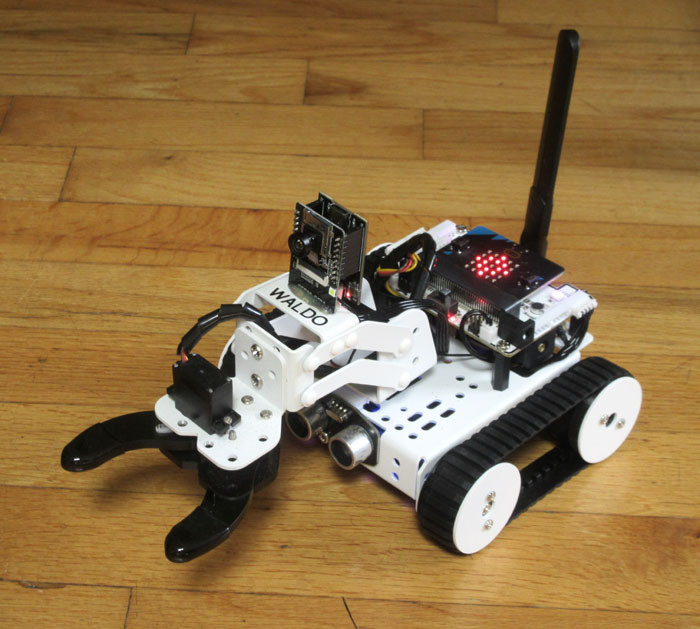

# Baijiu
## Minimalist Mobile Manipulator

This is about the cheapest (about $150) robot with an arm that you can build. It is based on a small tracked platform with a 2 DOF arm (+ gripper) and has add-on "riders" for audio and video. Remote access to the actuators and sensors is achieved through a combination of Bluetooth LE and wifi, which lets you run your main program offboard on a Windows PC. An example of simple remote keyboard control is provided, as well as a fancier speech-based system using the [ALIA](https://github.com/jconnell11/ALIA) reasoner (see [__video__](https://youtu.be/-0EnkERKow8)). 

## Overview

Note that a small amount of __soldering__ and __gluing__ is required to complete this robot.

1. [Parts List](parts_list.md)
2. [Assembly and Software](assembly.md)
3. [Camera Installation](camera.md)
4. [Speech Components](speech.md)
5. [Samples and Coding](coding.md)

For the fanciest demo double click the [__demo.bat__](../project/demo.bat) file. With or without speech, the ALIA sample will allow you to ask the robot "What is your name?" and command things like "Drive forward". You can also teach it things like "My name is Dan" or "To refuse, move the hand to the left then move it to the right". If rear corner lights are not green, you will need to get the robot's attention by starting your sentence with "robot" or "Waldo". 

For more examples of robot teaching check out [this](https://arxiv.org/abs/1911.09782) and [this](https://arxiv.org/abs/1911.11620). To see some other small robots that use ALIA, check out [Wansui](https://github.com/jconnell11/Wansui) and [Ganbei](https://github.com/jconnell11/Ganbei).

---

June 2026 - Jonathan Connell - jconnell@alum.mit.edu

