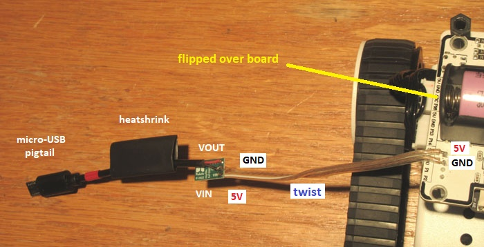
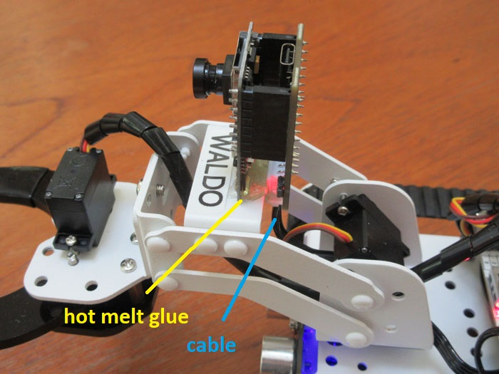
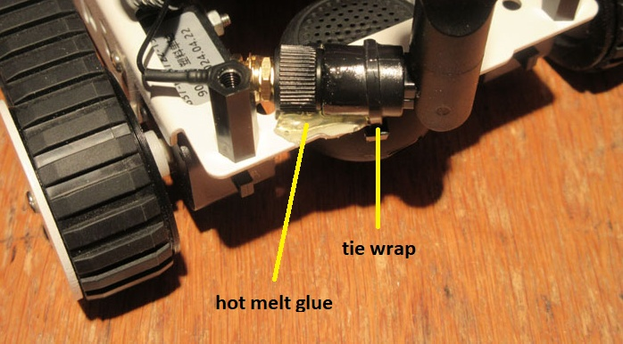

# Camera Installation

The small board camera mounts half-way out on the arm. It is essentially independent of the micro:bit robot and streams to the PC over a separate wifi connection. 

Since the video framerate depends on wifi signal strength (due to tcp protocol), it is best to use add an external antenna. This presses onto the small __bump-like connector__ near the bottom of the front board. You may have to push with pliers to get this to click on tightly. Note that there is a [jumper](https://m.media-amazon.com/images/I/71aNRFn491L._AC_SL1500_.jpg) that controls whether to use the onboard antenna versus this external connection. However, it is generally set in the correct position already if you order the camera and antenna as a package.

### Flashing Firmware

The ESP32-Cam module typically comes configured as a wifi access point (AP), which means the camera generates its own network (SSID). While this can be convenient for moving the robot between environments, it generally means having a second wifi [receiver](https://www.amazon.com/dp/B07P5PRK7J). To avoid this, configure the camera module for station mode (STA) by installing new firmware. Start by downloading and installing the [__Ardunio IDE__](https://www.arduino.cc/en/software/), then run the program and make sure the ESP processor package is installed:

    File -> Preferences -> Settings tab -> Additional Board Manager 
    https://www.arduino.com/package_esp32_index.json

Next, connect the back board of the camera module to your PC with a micro-USB cable. Using Windows __Device Manager__ look under "Ports" for a new device such as "CH340" and get its port number (e.g. COM7). In the network panel (tree icon) of the IDE pull down and select:

    "AI Thinker ESP32-CAM" and COM7 (or wherever)

Now you need to edit the source files a little. Load the base project by selecting:

    File -> Examples -> ESP32 -> Camera -> CameraWebServer

Edit the __CameraWebServer.ino__ file by doing the following:

    near the top: fill in ssid and password for your local network
    search (^F) for QVGA -> change it to read FRAMESIZE_VGA

Edit the __board_config.h__ file by selecting the correct camera model:

    comment out: CAMERA_MODEL_ESP_EYE
    un-comment: CAMERA_MODEL_AI_THINKER

Finally, click the circled right-arrow button near the top ("Upload"). The "Output" panel will show the programming process. When this completes, open the "Serial Monitor" panel (click upper right circle) and select 115200 baud (far right bottom). As the last step, hit the RST button (left) on the rear camera board to reboot. You sould get a message with the camera's __IP address__, something like:

    Camera Ready! Use 'http://192.168.0.240' to connect

Entering this into your browser will bring up a page with a bunch of controls, none of which need to be adjusted. However, you do need to record the camera IP in the __calibration file__ [tagig_calib.cfg](../project/config/tagig_calib.cfg) (or whatever the ID for your micro:bit board is). 

Be aware that this address can change! If you __cannot connect__ to the camera, either re-plug the USB cable to get the new address, or check the local router (usually 192.168.0.1 or 192.168.1.1) for a device mentioning "ESP". Record the new number in the calibration file. 

### Power Cable

Now comes the hardest part: modifying the cable to the camera. Although the Qtruck base does provide 5 volts, this is mostly for the arm servos. Any time the robot grabs something, the hand servo will stall out and wreck the 5V supply for about 3 seconds. Therefore, the tiny Pololu boost converter board needs to be wired into the power connection to the camera, as shown below.

Start by cutting the micro-USB cable to a lengh of 4 inches. Cut another 4" length out of the remainder (or use some other 2 conductor cable). Strip and tin all the wire ends. Insert the naked cable through the component side of the converter board and solder the red wire to "VIN" and the black wire to "GND". Now take the micro-USB connector cable and, on the back of the converter board, solder its red wire to "VOUT" and its black wire to "GND". Afterwards, slide a length of heatshrink tubing over the whole board assembly to insulate it (or just wrap it in electrical tape). Finally, locate port "1" on the right edge of the QTruck circuitboard (near the LED). Flip the board over and solder the exposed ends of the naked cable to the underside: the red wire goes to "5V" and the black wire goes to "GND".

### Physical Mounting

Start by replacing the __camera/lens assembly__ on the ESP32 board set. Pop the latch on the connector to release the flat cable, then carefully pry under the camera with an X-acto knife to dislodge it from the board. After this, insert the wide-angle module's cable into the connector and re-latch it. If the camera flops around, you can use thin double-sided Scotch tape to secure its backside to the chip.

The next task is to mount the camera board on the robot with a big glob of __hot melt glue__. Prop up the flat plate under the gripper 50 mm so that the middle section of the arm is roughly horizontal. Turn the robot on and point your browser to the camera's [IP address](http://192.168.0.240:81/stream) (from firmware section). Now spread a thick line of hot melt glue on the back of the middle arm platform, and poke the bottom of the ESP32-Cam board into it. The glue should mostly contact the front board and the micro-USB jacks should hang off the backside.  Tilt the camera slightly so all 4 top screws of the gripper servo are just in view, then hold the boards in this orientation until the glue cools and firms up.

Now screw the antenna onto its gold connector and bend it 90 degrees vertical. Temporarily remove the Qtruck circuitboard then use a __tie wrap__ to strap the antenna down. The side hole in the set of 3 holes at the back of the chassis is convenient for this purpose. Finally, slobber hot melt glue on both sides to keep it from rotating. The antenna should be centered and far enough back so it does not hit the circuitboard.

### Calibration

The calibration of the camera is accomplished through a utility that requires you to manually mouse click on certain features in the image. First, calibrate the __arm servos__ as described in the [Setup](assembly.md) section. Then start the program below and follow its instructions.

    py pc_blulink.py baijiu_cal

This will automatically rewrite the configuration file with the camera offsets determined.

---

June 2026 - Jonathan Connell - jconnell@alum.mit.edu