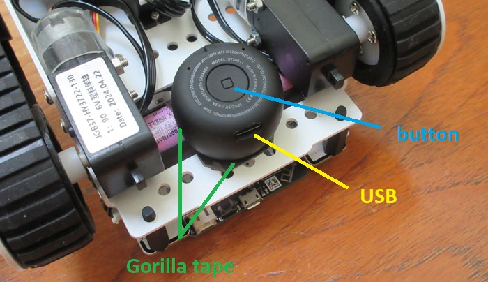

# Speech Components

Speech is entirely optional for the [ALIA](https://github.com/jconnell11/ALIA) reasoning system. You can __skip__ speech input, speech output, or both and simply interact through typing.

### Speaker Installation

Adding an external speaker/microphone combination allows you to talk directly to the physical robot instead of to your laptop (should you desire to use speech). Do this by flipping the robot over and affixing the mini-speaker to the underside using two strips of Gorilla double-sided tape: one on the chassis and one on the battery. The speaker should be mounted with its grill upwards (button downward) and its USB charging port toward the rear of the vehicle. A __double layer__ of tape often works best since it accommodates the mild curvature on top. 

### Text to Speech

Press the button underneath the mini-speaker until the blue light comes on solid then pair the speaker/mic (usually "MT") with your laptop. After this, adjust the audio settings by double clicking the [__speech.bat__](../project/speech.bat) file and choosing: 

* Voice selection = Microsoft David
* Audio Output ...
    * Playback tab = Headphones (Set Default)
    * Recording tab = Headset (Set Default)
    * Communications tab = Do nothing
    * Properties / Enhancements = Loudness Equalization
* Advanced ... = Use preferred audio output device

Of course you can use __other voices__ besides David -- Windows 11 also includes Zira and Hazel. If you want an even wider selection, download the [SAPI Adapter](https://github.com/gexgd0419/NaturalVoiceSAPIAdapter/releases) zip file for x64 then install some extra voices from [here](https://github.com/gexgd0419/NaturalVoiceSAPIAdapter/wiki/Narrator-natural-voice-download-links) (like Aria, Ryan, or Neerja). These will then show up in the speech control panel, just like David.

### Online Credentials

Speech recognition is done remotely and hence requires an internet connection to work. To set things up you will need a Microsoft [Azure](https://portal.azure.com/#create/Microsoft.CognitiveServicesSpeechServices) account (essentially free for low usage). From your Azure home page select "Speech Services" then "+ Create" then click on "Manage keys". Modify local text file [__spio_win.key__](../project/config/spio_win.key) with valid "Key" and "Location" strings to get the sample demo to run.

---

June 2026 - Jonathan Connell - jconnell@alum.mit.edu